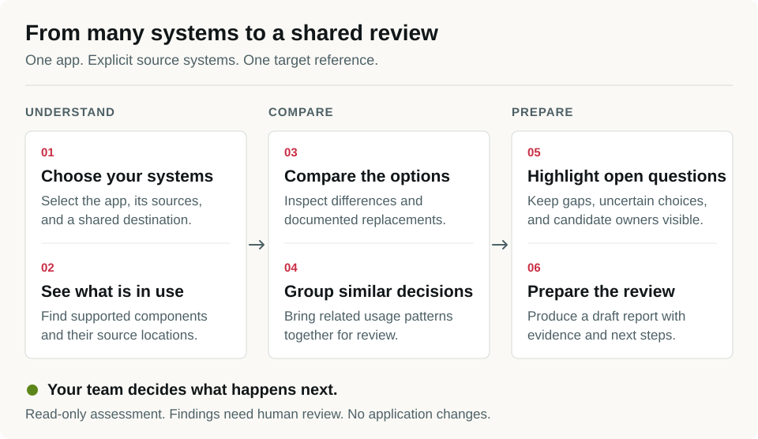

<p align="center">
  <picture>
    <source media="(prefers-color-scheme: dark)" srcset="assets/brand/rhubase/header-dark.svg">
    
  </picture>
</p>

[](https://github.com/PetriLahdelma/rhubase/actions/workflows/ci.yml)
[](LICENSE)
[](docs/validation.md)
[](docs/getting-started.md)

[Get started](docs/getting-started.md) · [Use cases](docs/use-cases.md) · [Contribute](CONTRIBUTING.md) · [Discussions](https://github.com/PetriLahdelma/rhubase/discussions)

RhuBase is an open-source, local-first tool for understanding design-system migrations and consolidations. It inventories supported component usage in a consumer repository, compares explicitly selected source systems with one target, and produces a reviewable decision report.

RhuBase is an alpha. Its supported workflows are read-only: it does not edit applications, run repository scripts, call an AI service, fetch packages from a registry, or open pull requests. Migration execution is not ready. Two independent inference holdouts missed their frozen thresholds; the known failures are regression-tested, but reliability on new systems remains unproven.

## What works today

- **Consumer assessment:** inspect one local React/TypeScript consumer, one or more explicitly selected source packages, and one target package.
- **Many-to-one consolidation view:** group supported usages by migration-relevant conditions while preserving source-system identity.
- **Draft contract inference:** compare two immutable local package snapshots, including supported TypeScript exports, props, tokens, and selected migration documentation.
- **Review artifacts:** write portable JSON, human-readable Markdown, pairwise contracts, evidence, coverage gaps, and an artifact manifest.
- **Fail-visible analysis:** keep wrappers, dynamic access, spreads, style side effects, unsupported CODEOWNERS patterns, and other blind spots in the report.

Every assessment is `draft-review`, every decision remains `needs-review`, and every artifact is non-executable.

## From many systems to a shared review

[](docs/assets/rhubase-process.svg)

Read each column from top to bottom. Select your app, its source systems, and a target reference; RhuBase gathers evidence and prepares a draft. Your team decides which changes to pursue.

[Full process chart](docs/assets/rhubase-process.svg) · [Editable PDF](docs/assets/rhubase-process.pdf) · [How it works](docs/how-it-works.md)

## Install from GitHub

RhuBase is not published to npm or crates.io. Build it from this repository:

```sh
git clone https://github.com/PetriLahdelma/rhubase.git
cd rhubase
npm ci --ignore-scripts
cargo build --release --locked --bin ctrl-shift
./bin/rhubase --help
```

Requirements:

- macOS for the currently supported assessment publication path;
- Node.js 22 or newer;
- Rust 1.93.0; and
- network access during the initial dependency download.

After dependencies are present and the binary is built, assessment and inference run locally without an AI service, API key, account, or network connection.

## Try the controlled example

```sh
npm run example:assess
```

The command creates a fresh synthetic two-source consolidation fixture in scratch space and prints the external report path. It is safe to inspect and useful for learning the report format. It is not evidence that RhuBase is reliable on real repositories.

## Assess a local consumer

```sh
./bin/rhubase assess ./consumer-app \
  --source @company/legacy-web \
  --source @company/legacy-admin \
  --target @company/foundation \
  --out ../consumer-assessment
```

Sources and target may be workspace package names, installed package names, or explicit local package paths. Registry downloads and version selectors are intentionally unsupported. The output directory must be new and outside protected inputs.

The report separates observations from decisions. It shows supported usage patterns, representative source excerpts, candidate owners, documentation-backed target candidates, declared-but-unrun checks, and gaps that still need investigation. A missing candidate means the bounded parser did not establish one; it does not mean guidance or a valid migration path is absent.

## Compare two package snapshots

```sh
./bin/rhubase infer \
  --from ./design-system-v4 \
  --to ./design-system-v5 \
  --out ../migration-contract.json
```

Inference produces a draft, non-executable contract. Documentation proposals require review. The original blind evaluation and independent follow-up both failed, primarily because documentation mapping did not generalize sufficiently. See [validation status](docs/validation.md) before relying on inferred mappings.

## Verify a checkout

```sh
npm run verify
```

On macOS, the longer CLI and process-lifecycle suite is available separately:

```sh
npm run test:cli
```

See [validation status](docs/validation.md) for the failed holdouts, the passing controlled assessment boundary, and the remaining evidence gaps. Passing development tests establishes the tested boundary; it does not establish migration correctness or customer readiness.

## Documentation

- [Getting started](docs/getting-started.md)
- [Use cases](docs/use-cases.md)
- [How it works](docs/how-it-works.md)
- [Troubleshooting](docs/troubleshooting.md)
- [Roadmap](docs/roadmap.md)
- [Documentation index and historical research](docs/README.md)

## Community

RhuBase is early, and thoughtful issue reports are more valuable than hype. Bring a small reproducible fixture, explain the expected result, and include the report’s visible gaps. Please read [CONTRIBUTING.md](CONTRIBUTING.md), [SUPPORT.md](SUPPORT.md), and the [Code of Conduct](CODE_OF_CONDUCT.md).

Security reports should follow [SECURITY.md](SECURITY.md).

## Support RhuBase

RhuBase is free and open source. If you find it useful, optional donations help support its development. Bug reports, useful fixtures, documentation, and sharing the project are welcome contributions too.

[](https://buymeacoffee.com/petrilahdey)

## License

Original RhuBase code is available under the [MIT License](LICENSE). Third-party fixtures, references, and generated artifacts retain their own notices and terms where stated.
